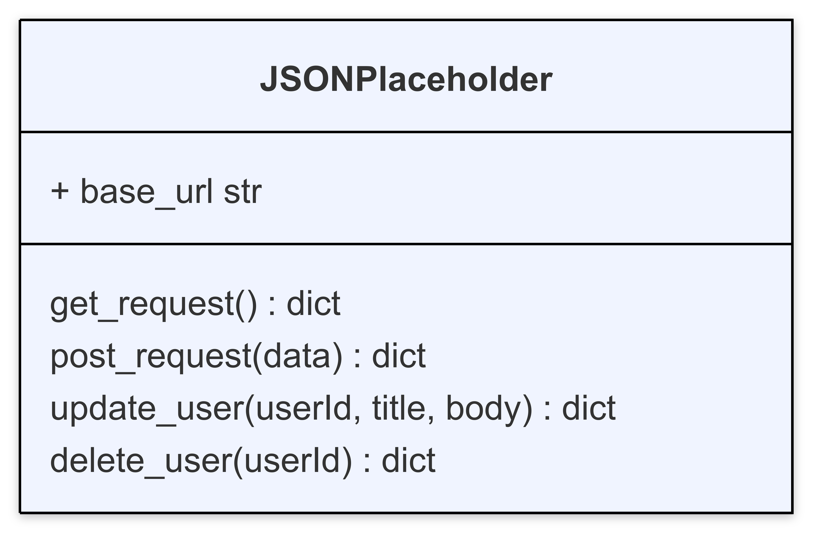

# Assignment #7 - `GET` and `POST` Requests

**TASK**: Create a `JSONPlaceholder` class that implements `GET` and `POST` requests using the `requests` module. The class has the following class diagram



The class is initialized with a `base_url` property that will be the endpoint where the requests are sent. The endpoint for this assignment should be [JSON Placeholder posts](https://jsonplaceholder.typicode.com/posts).

The class should have the following methods:
- `get_request()`: Sends a `GET` request to the `base_url`. Returns a dictionary with the (1) status code, (2) headers, and (3) first 500 characters in the response body.
- `get_request_by_userid(user_id)`: Sends a `GET` request to the `base_url` modified with the `user_id` added as a query parameter (e.g. if the user_id is 3 then the endpoint should be: `https://jsonplaceholder.typicode.com/posts?userId=3)`. Returns a dictionary with the (1) status code, (2) headers, and (3) first 500 characters in the response body.
- `post_request(data)`: Takes a dictionary of data and sends a `POST` request with the data to the base_url. It then returns a dictionary with the (1) status code, (2) headers, and (3) first 500 characters in the response body.

The format of the dictionary being returned is shown below:
```python
example_dictionary = { 
    "status_code": "STATUS_CODE_HERE", 
    "headers": "HEADERS HERE", 
    "content": "CONTENT_HERE" 
}
```

## Grading Your Work
This assignment can grade itself! To setup the autograding, you should do the following:
1. Clone this file to your local machine using the command
```bash
git clone PASTE_URL_HERE
```
2. Open the downloaded file in your VS Code editor.
3. In the left hand sidebar, press the "Testing" menu represented by the picture of a flask.
4. Click "Configure Python Tests".
5. You'll have two options to select. Select **pytest**.
6. Select the folder where the tests live. You can simply select `. Root directory`.
7. You can now run the tests by pressing the play icon. A passing test will get a ✅ and a failing test will get a ❌.
8. Run the tests as you code and by the end it should be all ✅ if you have followed the specifications for this assignment!

## Unit Test Explanations

Below is a summary of what each unit test for this assignment is checking for.

### Class Initialization Test
- `test_jsonplaceholder_initialization`: Test if JSONPlaceholder class is initialized correctly with `base_url`.

### `GET` Requests Tests
- `test_get_request_success`: Test if `get_request` method returns correct data structure with expected values.
- `test_get_request_with_correct_url`: Test if `get_request` method calls requests.get with the correct URL.
- `test_get_request_by_userid_success`: Test if `get_request_by_userid` method returns correct data structure.
- `test_get_request_by_userid_correct_parameters`: Test if get_request_by_userid method calls requests.get with correct parameters.

### `POST` Requests Tests
- `test_post_request_success`: Test if post_request method returns correct data structure.
- `test_post_request_correct_parameters`: Test if post_request method calls requests.post with correct parameters.